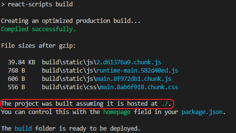

# electron-react-example

This tutorial is intended to give a minimal example how to open a React app created with `create-react-app` in an `electron` window and build it into an executable using `electron-builder`. It shall give a basic foundation.

Additional concepts like linters, test frameworks less compilers or typescript will therefore not be topic of this tutorial.

# Prerequisites

To follow this tutorial you need to bring:

- Node.js (and with it `npm`)
- basic understanding on how `npm` works

# Overview

This tutorial uses a 2 folder layout:

```
electron-react-example //the root directory
|_gui //your react app is in here
  |_public
  |_src
  |_...
  |_package.json
|_main.js
|_...
|_package.json
```

In the root directory will be your electron app, in the `gui` directory your react app.

# Setting up the root directory

First we create our `root` directory. This directory will hold both our electron app and the react app.

```
mkdir electron-react-example
cd electron-react-example
```

Now we initialize it in order to create the `package.json`. Most metadata asked will not affect the functionality of this tutorial project, so if you are not sure, it is fine to use the default. The mainscript however is important for us now, as this is how we need to name our electron main script. For this tutorial we name it `main.js`, so make sure that in the resulting `package.json` the attribute `main` is set to `main.js`:

```
"main": "main.js",
```

If you want to know what those fields are for, feel free to read the [npm package.json documentation](https://docs.npmjs.com/files/package.json).

```
npm init
```

Our directory should now look like this:

```
electron-react-example
|_package.json
```

# Create the gui directory

Now we can create our React app. Make sure that your working directory is still our project root `electron-react-example`. You can name your app however you like, for this tutorial I go with the name `gui`.

```
npx create-react-app gui
```

After this, your project folder should look like this:

```
electron-react-example
|_gui
. |_public
. |_src
. . |_App.css
. . |_App.js
. . |_...
. |_...
. |_package.json
|_package.json
```

## Start the react app

To test out whether our app was correctly installed, go into the `gui` folder and run the start script:

```
cd gui
npm start
```

This should start a devserver and open a browser window with the served site.


## Troubleshooting

If you see files missing in the react app, you may have an older `create-react-app` installed globally. This seems to be a problem (or intended behavior?) with the current `create-react-app` (3.3.1).

You can fix that by removing the old installation:

```
npm rm -g create-react-app
```

Remove then the broken `gui` directory and try again.

```
rm -rf gui
npx create-react-app gui
```

# Integration into an electron app

Now that we have a working react app, it is time to build our electron app around it.

Go back into the root directory `electron-react-example` and install electron:

```
npm i electron -D
```

Your root directory should now look like this:

```
electron-react-example
|_gui
|_node_modules
|_package.json
```

With electron installed, we can now write our main script. Create a file `main.js` with the content:

```
const { app, BrowserWindow } = require("electron");

let win;
app.whenReady().then(() => {
  win = new BrowserWindow({
    height: 800,
    width: 1000
  });
  if (app.isPackaged) {
    win.loadFile("./gui/build/index.html");
  } else {
    win.loadURL("http://localhost:3000");
  }
});
```

In this script we wait until the app is ready to open a `BrowserWindow`. We then create a window and load a website. If our app is packaged we load the built react app, if not, use the site served by the react dev server.

You can run this script now by running:

```
npx electron .
```

or using the locally installed instance by adding the following npm script to your `package.json` and running it via `npm start`:

```
"start": "electron ."
```

Doing this a window should open. It shows either tha same blue react site, or is white in case you have stopped the react dev server along the way. If you restart the dev server and reload the page, you should then see the react app hosted on the dev server.

# Building your app into an executable

Now, we didn't choose electron to have a server host our site, right?

## Building the react app

If you take a look at our main script, you see that we load a different site, when the app is packaged.

```
 if (app.isPackaged) {
    win.loadFile("./gui/build/index.html");
  }
```

To create this site we have to switch into the `gui` directory and run:

```
npm run build
```

This will create the final site inside the `gui/build` directory. If we would now load this `index.html` site inside our electron window we would see... nothing. A white page.

The react scripts in `create-react-app` are optimized for apps hosted on a server. In electron however, we load the site from relative file paths. We can trick it to built the site for the way we want by adding the `homepage` attribute to `gui/package.json`.

```
"homepage": "."
```

Make sure that you added it to the `package.json` inside the `gui` directory and not the one in our root directory.

After doing this, run in the gui directory again:

```
npm run build
```

Now you should see this line in the output:

```
The project was built assuming it is hosted at ./.
```

This is exactly what we want.



## Installing electron-builder

For this tutorial we use `electron-builder` to create our executable. In our root directory `electron-react-example` we run the npm command to install it:

```
npm i electron-builder -D
```

`electron-builder`s default behaviour is enough for now, so we don't require any additional configuration. If you want to pimp your app afterwards, see the [electron-builder documentation](https://www.electron.build/).

## Building the electron executable

To build or application we now only have to run the electron-builder in our root directory:

```
electron-builder
```

After building you'll find the result inside the newly created `dist` directory.

For example the result on my Windows machine looks like this:


You see here the `win-unpacked` directory (or an equivalent for your platform). This contains the built files (just not packed into an installer).

Next to it you see the `electron-react-example Setup 1.0.0.exe` (or the packed variant for your platform). This is the NSIS installer that you would ship.

The `latest.yml` is important if you plan to use AutoUpdate for your app.

For us, the `win-unpacked` folder is intersting, because we now want to see whether our app works as binary. Inside the `win-unpacked` folder, you will find the `electron-react-example.exe`. If you start this binary on the command line, a window should open and should show the blue, react default site.

```
./dist/win-unpacked/electron-react-example.exe
```
